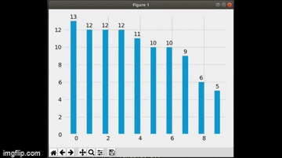

# The Price's law or Pareto principle

0. pareto.py is the script for this. The other are not for pareto. So don't bother.
1. A simple python visualization of the pareto principle.
2. 10 people starts out with 10 dollars each.
3. Each flips a coin, if heads he gives away 1 dollar, else gets one dollar from the other person.
4. Everyone trades with everyone else in each turn this way.
5. At the end almost 20% of the peole gets the 80% of the wealth of this environment.
6. 
